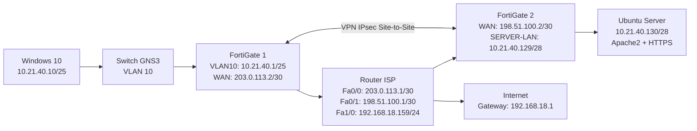

# VPN Site-to-Site con FortiGate en GNS3

Laboratorio de implementación de una VPN IPsec Site-to-Site entre dos dispositivos FortiGate en GNS3.

El proyecto integra segmentación mediante VLAN, DHCP, enrutamiento, políticas de firewall, NAT/PAT, un servidor web HTTPS sobre Ubuntu Server y pruebas de conectividad para demostrar el funcionamiento del túnel VPN.

---

## Video demostrativo

> Agregar aquí el enlace al video de demostración cuando esté disponible.

---

## Objetivo

Implementar una infraestructura de red en GNS3 que permita la comunicación segura entre una red de usuarios y una red de servidores mediante una VPN IPsec Site-to-Site entre dos FortiGate.

El laboratorio incluye:

- VLAN 10 para usuarios.
- DHCP para clientes.
- Router ISP.
- Dos FortiGate.
- VPN IPsec Site-to-Site.
- NAT/PAT para salida a Internet.
- Ubuntu Server con Apache2 y HTTPS.
- Windows 10 como cliente.
- Pruebas de conectividad.
- Pruebas de dependencia de la VPN.

---

## Topología



También se incluye una versión dedicada en [Topologia/topologia.md](Topologia/topologia.md).

---

## Plan de direccionamiento

| Dispositivo | Interfaz | Dirección IP | Gateway |
|---|---|---|---|
| Router ISP | FastEthernet0/0 | `203.0.113.1/30` | — |
| FortiGate 1 | port1 | `203.0.113.2/30` | `203.0.113.1` |
| Router ISP | FastEthernet0/1 | `198.51.100.1/30` | — |
| FortiGate 2 | port1 | `198.51.100.2/30` | `198.51.100.1` |
| Router ISP | FastEthernet1/0 | `192.168.18.159/24` | `192.168.18.1` |
| FortiGate 1 | VLAN10-USUARIOS | `10.21.40.1/25` | — |
| Windows 10 | Ethernet | `10.21.40.10/25` | `10.21.40.1` |
| FortiGate 2 | port2 | `10.21.40.129/28` | — |
| Ubuntu Server | ens3 | `10.21.40.130/28` | `10.21.40.129` |

Documentación completa: [Direccionamiento%20IP/direccionamiento.md](Direccionamiento%20IP/direccionamiento.md)

---

## FortiGate 1

### WAN

```text
Interfaz: port1
IP: 203.0.113.2/30
Gateway: 203.0.113.1
Rol: WAN
```

### VLAN 10

```text
Nombre: VLAN10-USUARIOS
Interfaz física: port2
VLAN ID: 10
IP: 10.21.40.1/25
```

### DHCP

```text
Rango: 10.21.40.10 - 10.21.40.100
Gateway: 10.21.40.1
DNS: 8.8.8.8, 1.1.1.1
```

---

## FortiGate 2

### WAN

```text
Interfaz: port1
IP: 198.51.100.2/30
Gateway: 198.51.100.1
```

### Red de servidores

```text
Interfaz: port2
Alias: SERVER-LAN
IP: 10.21.40.129/28
```

---

## VPN IPsec Site-to-Site

### FortiGate 1

```text
Nombre: VPN-FG1-FG2
Peer: 198.51.100.2
Red local: 10.21.40.0/25
Red remota: 10.21.40.128/28
```

### FortiGate 2

```text
Nombre: VPN-FG2-FG1
Peer: 203.0.113.2
Red local: 10.21.40.128/28
Red remota: 10.21.40.0/25
```

---

## Políticas de firewall

### FortiGate 1

```text
VLAN10-USUARIOS → VPN-FG1-FG2
Action: ACCEPT
NAT: Disabled
```

```text
VPN-FG1-FG2 → VLAN10-USUARIOS
Action: ACCEPT
NAT: Disabled
```

```text
VLAN10-USUARIOS → port1
Policy: USUARIOS-INTERNET
Action: ACCEPT
NAT: Enabled
```

### FortiGate 2

```text
SERVER-LAN → VPN-FG2-FG1
Action: ACCEPT
NAT: Disabled
```

```text
VPN-FG2-FG1 → SERVER-LAN
Action: ACCEPT
NAT: Disabled
```

---

## Router ISP

```text
FastEthernet0/0
203.0.113.1/30
NAT inside

FastEthernet0/1
198.51.100.1/30
NAT inside

FastEthernet1/0
192.168.18.159/24
NAT outside
```

Ruta por defecto:

```text
0.0.0.0/0 → 192.168.18.1
```

PAT mediante `route-map NAT-INTERNET` utilizando ACL 110.

---

## Ubuntu Server

```text
Sistema: Ubuntu Server 24.04.1
Interfaz: ens3
IP: 10.21.40.130/28
Gateway: 10.21.40.129
DNS: 8.8.8.8, 1.1.1.1
Servicio: Apache2 + HTTPS
```

URL de prueba:

```text
https://10.21.40.130
```

---

## Pruebas realizadas

| Prueba | Resultado |
|---|---|
| Windows → `10.21.40.1` | Correcto |
| Ubuntu → `10.21.40.129` | Correcto |
| Windows → `10.21.40.130` por VPN | Correcto |
| Ubuntu → Windows por VPN | Correcto |
| HTTPS a `https://10.21.40.130` | Correcto |
| Traceroute Windows → Ubuntu | Correcto |
| Ping con política VPN bloqueada | Falla esperada |
| HTTPS con política VPN bloqueada | Falla esperada |
| Windows → `8.8.8.8` | Correcto |
| `nslookup google.com` | Correcto |
| Ping a `google.com` | Correcto |

---

## Evidencias

- [Evidencias FortiGate](Evidencias/Evidencias%20FortiGate/Evidencias%20FortiGate.pdf)
- [Evidencias Windows](Evidencias/Evidencias%20windows/Evidencias%20Windows.pdf)
- [Evidencias Ubuntu Server](Evidencias/Evidencias%20Ubuntu%20Server/Evidencias%20Ubuntu%20Server.pdf)

---

## Running-config

- [FortiGate 1](Running-config%20FortiGate%20FG1/Running-config%20Fortigate%201/show%20running-config%20FortiGate%201.txt)
- [FortiGate 2](Running-config%20FortiGate%20FG1/Running-config%20Fortigate%202/Running-config%20FortiGate%20FG2.txt)
- [Router ISP](Running-config%20R-ISP/show%20running-config.txt)
- [Configuración del ISP](Running-config%20R-ISP/ROUTER%20ISP%20-%20CONFIGURACION.txt)

---

## Script del servidor

- [Script Ubuntu Server](Script%20servidor/Script%20servidor.txt)

---

## Resultado final

El laboratorio permitió establecer correctamente una VPN IPsec Site-to-Site entre ambos FortiGate.

Se comprobó:

- comunicación entre las dos redes privadas;
- acceso HTTPS entre cliente y servidor;
- comunicación bidireccional;
- funcionamiento de VLAN 10;
- funcionamiento de DHCP;
- enrutamiento entre las sedes;
- funcionamiento de NAT/PAT;
- acceso a Internet;
- resolución DNS;
- dependencia del túnel VPN para la comunicación entre las LAN.

---

## Tecnologías utilizadas

```text
GNS3
FortiGate 7.0.9
Cisco IOS
Windows 10
Ubuntu Server 24.04.1
IPsec
VLAN
DHCP
NAT/PAT
Apache2
HTTPS
```
