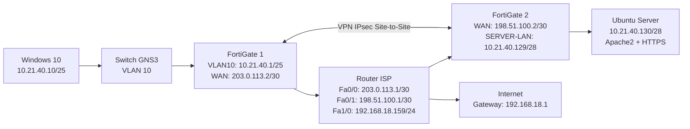

# Topología del Laboratorio




## Redes involucradas

```text
Usuarios:      10.21.40.0/25
Servidores:    10.21.40.128/28
WAN FG1:       203.0.113.0/30
WAN FG2:       198.51.100.0/30
Red externa:   192.168.18.0/24
```

## Flujo principal

```text
Windows 10
10.21.40.10
   |
   v
FortiGate 1
10.21.40.1 / 203.0.113.2
   |
   | VPN IPsec Site-to-Site
   v
FortiGate 2
198.51.100.2 / 10.21.40.129
   |
   v
Ubuntu Server
10.21.40.130
```
